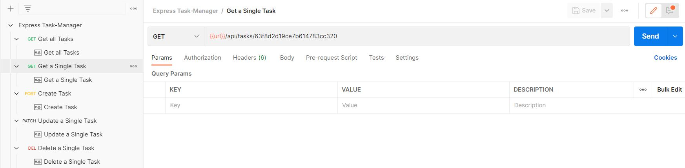

# **Project Setup**
In order to run the project, setup **.env** file for reference see **.env.example** file and set MONGO_URI variable equal to DB connection string.
Install Node Js and mongodb on your system.
Run the following command in your terminal 

```Bash
cd 
Express-API
npm i
```
This will install all the necessary packages in the system locally and a node_modules folder will be created.
Then run following command to run the server normally :
```bash
npm run start
```
You can also run the server in development mode using the following command:
```bash
npm run dev
```


# **<u>API Documentation</u>**
# **Express Task-Manager**
[**Postman Documentation**](https://documenter.getpostman.com/view/20578649/2s93CPqXSH)

This collection contains sample request from this API. 
It contains following requests.
* Get all Tasks
* Get a Single Task
* Create Task
* Update a Single Task
* Delete a Single Task

## **Get all Tasks**
API endpoint to get the list of all tasks available in the database.
* A successful API request will return HTTP 200 status code.

**METHOD: GET**

*url:- <code>{{url}}/api/tasks</code>*
<p align="center">

<i>Screenshot from Postman for request to Get all Tasks</i>
</p>

###  Response
```Json
{
    "tasks": [
        {
            "completed": true,
            "_id": "63f8d2d19ce7b614783cc320",
            "name": "Finish writing report",
            "__v": 0
        },
                {
            "completed": true,
            "_id": "63f8d2d19ce7b614783cc322",
            "name": "Go for a run",
            "__v": 0
        },
        {
            "completed": false,
            "_id": "63f8d2d19ce7b614783cc327",
            "name": "Prepare for job interview",
            "__v": 0
        },
        {
            "completed": true,
            "_id": "63f8d2d19ce7b614783cc328",
            "name": "Attend team meeting",
            "__v": 0
        },
        {
            "completed": true,
            "_id": "63f8d2d19ce7b614783cc329",
            "name": "Organize closet",
            "__v": 0
        },
        {
            "completed": false,
            "_id": "63f8d2d19ce7b614783cc32a",
            "name": "Fix leaky faucet",
            "__v": 0
        },
        {
            "completed": false,
            "_id": "63f8d2d19ce7b614783cc32b",
            "name": "Read a book",
            "__v": 0
        },
        {
            "completed": true,
            "_id": "63f8d2d19ce7b614783cc32c",
            "name": "Watch a movie",
            "__v": 0
        }
    ]
}

```
## **Get a Single Task**
API endpoint to get a single task using the id of the task.
* A successful API request will return HTTP 200 status code.
* Request for a non-existing task or request with a wrong task id will return HTTP 404 status code.

**METHOD: GET**

*url:- <code>{{url}}/api/tasks/63f8d2d19ce7b614783cc320
</code>*
<p align="center">

<i>Screenshot from Postman for request to Get a single Task using id</i>
</p>

###  Response
```Json
{
    "task": {
        "completed": true,
        "_id": "63f8d2d19ce7b614783cc320",
        "name": "Finish writing report",
        "__v": 0
    }
}
```
## **Create Task**
API endpoint to create a tasks.
* A successful API request will return HTTP 201 status code.

**METHOD: POST**

*url:- <code>{{url}}/api/tasks/</code>*

**Request Headers**
```json
'Content-Type': 'application/json'
```
**Request Body**
```Json
  {
    "name": "Visit a Garden",
    "completed": false
  }
```
<p align="center">

<i>Screenshot from Postman for request to Create a Task</i>
</p>

###  Response
```Json
{
    "task": {
        "completed": false,
        "_id": "63fa0a6fab686f1acc074667",
        "name": "Visit a Garden",
        "__v": 0
    }
}
```

## **Update a Single Task**
API endpoint to update a single task using the id of the task.
* A successful API request will return HTTP 200 status code.
* Request to update a non-existing task or request with a wrong task id will return HTTP 404 status code.

**METHOD: PATCH**

*url:- <code>{{url}}/api/tasks/63f8d5ac9ce7b614783cc34e
</code>*

**Request Headers**
```json
'Content-Type': 'application/json'
```
**Request Body**
```Json
  {
    "completed": false,
    "name": "Visit a Green Garden"
  }
```
</code>*
<p align="center">

<i>Screenshot from Postman for request to Update a single Task using id</i>
</p>

###  Response
```Json
{
    "task": {
        "completed": false,
        "_id": "63f8d2d19ce7b614783cc320",
        "name": "Visit a Green Garden",
        "__v": 0
    }
}
```

## **Delete a Single Task**
API endpoint to delete a single task using the id of the task.
* A successful API request will return HTTP 200 status code.
* Request to delete a non-existing task or request with a wrong task id will return HTTP 404 status code.

**METHOD: DELETE**

*url:- <code>{{url}}/api/tasks/63f8d28d9ce7b614783cc319
</code>*

</code>*
<p align="center">

<i>Screenshot from Postman for request to Delete a single Task using id</i>
</p>

###  Response
```Json
{
    "task": {
        "completed": false,
        "_id": "63f8d2d19ce7b614783cc320",
        "name": "Visit a Green Garden",
        "__v": 0
    }
}
```


# How to setup an express REST API
## Prerequisites 
Start by installing node js and mongo db on your system.
After installing check if they have been installed properly, to check node version use:
```Javascript 
node -v
```
to check mongo version use:
```Javascript 
node --version
```
## Start the Project
### package.json
Create your package.json file by entering the following command in terminal.
```Javascript
npm init -y
```
we will be using npm package **express** to create the server and **mongoose** to interact with the mongodb data base, so install both locally in your system using following command.
```Javascript
npm install express
npm install mongoose
```
A **node_modules** folder will be created automatically, it contains all the modules and their respective dependencies.
These dependencies will be added to your **package.json** file automatically, so once you are done with the project, you can **share** the project with anyone **without node_modules** folder,as this folder contains all the modules used in the project, it is usually **bigger in size** and it's **not recommended to share** the node_modules folder as well without your project. **node_modules** folder can be **recreated** with the help of **package.json** file using the following command.
```Javascript
npm i
``` 
We need to create a:
* **Model**:
Models in an Express API are used to define the structure of data that is stored in a database. They contain the schema and validation rules for the data, and provide an interface for performing CRUD (Create, Read, Update, Delete) operations on the data. Models are often used in conjunction with an Object-Relational Mapping (ORM) library like Mongoose to interact with a database.

* **Middleware**:
Middleware functions in an Express API are functions that are executed in between the request and response of an API. They can be used to modify the request or response objects, execute code, or authenticate a user. Middleware functions are registered using the **app.use()** function, and they can be applied globally or only to specific routes. 

* **Controller**:
Controllers are used to define functions that handle specific routes in an Express API. They contain the business logic of the API, such as fetching data from a database or sending a response to the client. Controllers are responsible for validating the request, executing the necessary operations, and sending the response back to the client. A controller is typically defined as a function that takes the request and response objects as input parameters.

* **Routes**:
In an Express application, the routes folder typically contains files that define the routes for the API. Each file in the routes folder corresponds to a specific section or feature of the API and contains functions that define the HTTP endpoints (i.e., routes) for that section of the API.

## **model/Task.js**
First create a new folder called **models** inside create a file **Task.js** to create the schema for task, schema defines the fields that a document can have, their data types, and any validation rules.
Create the schema using the following code:
```Javascript
const mongoose = require('mongoose')
const TaskSchema = new mongoose.Schema({
  name: {
    type: String,
    required: [true, 'must provide name'],
    trim: true,
  },
  completed: {
    type: Boolean,
    default: false,
  },
})
module.exports = mongoose.model('Task', TaskSchema)
```
`const mongoose = require('mongoose')`: This line imports the Mongoose library and assigns it to a constant named mongoose. Mongoose is an Object-Document Mapping (ODM) library that provides a higher-level interface for working with MongoDB.

`const TaskSchema = new mongoose.Schema({ ... })`: This line defines a **new Mongoose schema** called **TaskSchema** that describes the **structure of a document** in the **"tasks" collection** of a MongoDB database. 

`name: { type: String, required: [true, 'must provide name'], trim: true }`: This line defines a field called **name** in the schema, which has a **string data type**. The required attribute specifies that a **value for this field is required**, and if it is **missing**, Mongoose will return an **error** with the **message** *'must provide name'*. The **trim** attribute specifies that any **whitespace** at the beginning or end of the value will be **removed**.

`completed: { type: Boolean, default: false }`: This line defines a field called **completed** in the schema, which has a **boolean data type**. The default attribute specifies that if a value for this field is not provided, it will default to false.

`module.exports = mongoose.model('Task', TaskSchema)`: This line **exports a Mongoose model** for the **Task** schema, which can be used to perform CRUD operations on the **"tasks" collection** of a MongoDB database. The model() method takes two arguments: the name of the model ('Task') and the schema (TaskSchema).

## **middleware**
First create a new folder called **middleware**.
### middleware/async.js
Now create a file **async.js** using the following code:
```Javascript
const asyncWrapper = (fn) => {
  return async (req, res, next) => {
    try {
      await fn(req, res, next)
    } catch (error) {
      next(error)
    }
  }
}
module.exports = asyncWrapper
```
This code defines a function named asyncWrapper that takes a function fn as an argument and returns an async function that calls fn with the req, res, and next arguments, and catches any exceptions that might be thrown. This function is designed to be used as middleware in an Express.js application.

### middleware/not-found.js
Now create a file **not-found.js** using the following code:
```Javascript
const notFound = (req, res) => res.status(404).send('Route does not exist')
module.exports = notFound
```
This code exports a function that sends a plain text response with a 404 status code and a "Route does not exist" message when the requested resource is not found in the Express.js application.

## **controller/tasks.js**
First create a new folder called **controller** inside create a file **tasks.js** to create controller for the api using the following code:
```Javascript
const Task = require('../models/Task')
const asyncWrapper = require('../middleware/async')
const getAllTasks = asyncWrapper(async (req, res) => {
  const tasks = await Task.find({})
  res.status(200).json({ tasks })
})

const createTask = asyncWrapper(async (req, res) => {
  const task = await Task.create(req.body)
  res.status(201).json({ task })
})

const getTask = asyncWrapper(async (req, res, next) => {
  const { id: taskID } = req.params
  const task = await Task.findOne({ _id: taskID })
  if (!task) {
    return res.status(404).json({ error:`No task with id : ${taskID}` })
  }

  res.status(200).json({ task })
})
const deleteTask = asyncWrapper(async (req, res, next) => {
  const { id: taskID } = req.params
  const task = await Task.findOneAndDelete({ _id: taskID })
  if (!task) {
    return res.status(404).json({ error:`No task with id : ${taskID}` })
  }
  res.status(200).json({ task })
})
const updateTask = asyncWrapper(async (req, res, next) => {
  const { id: taskID } = req.params

  const task = await Task.findOneAndUpdate({ _id: taskID }, req.body, {
    new: true,
    runValidators: true,
  })

  if (!task) {
    return res.status(404).json({ error:`No task with id : ${taskID}` })
  }

  res.status(200).json({ task })
})

module.exports = {
  getAllTasks,
  createTask,
  getTask,
  updateTask,
  deleteTask,
}
```
`const Task = require('../models/Task')`: 
This line **imports the Task model** from the **models folder**. This model is used to interact with the database to perform CRUD operations on tasks.
`const asyncWrapper = require('../middleware/async')`:
This line **imports the asyncWrapper middleware** function from the middleware folder. This function is used to wrap async functions to handle errors.
All functions used in the code are wrapped in the asyncWrapper function.
```Javascript
const getAllTasks = asyncWrapper(async (req, res) => {
  const tasks = await Task.find({})
  res.status(200).json({ tasks })
})
```
This code defines a function named **getAllTasks** that is an **asynchronous function** wrapped by the asyncWrapper middleware function. The function **uses** the **Task model** to **retrieve all tasks from the database** and sends a JSON response with a **200** status code.
```Javascript
const createTask = asyncWrapper(async (req, res) => {
  const task = await Task.create(req.body)
  res.status(201).json({ task })
})
```
This code defines a function named **createTask** . The function uses the **Task model** to **create a new task** in the database **using data from the request body** and sends a JSON response with a **201** status code.
```Javascript
const getTask = asyncWrapper(async (req, res, next) => {
  const { id: taskID } = req.params
  const task = await Task.findOne({ _id: taskID })
  if (!task) {
    return res.status(404).json({ error:`No task with id : ${taskID}` })}
})
```
This code defines a function named **getTask**. The function **retrieves a task** with a **specific ID** from the database using the Task model and sends a JSON response with a **200** status code **if the task exists**. If the **task does not exist**, the function sends an **404** status code with message that task does not exist.
```Javascript
const deleteTask = asyncWrapper(async (req, res, next) => {
  const { id: taskID } = req.params
  const task = await Task.findOneAndDelete({ _id: taskID })
  if (!task) {
    return res.status(404).json({ error:`No task with id : ${taskID}` })
  }
  res.status(200).json({ task })
})
```
This code defines a function named **deleteTask** . The function **removes a task** with a **specific ID** from the database using the Task model and sends a JSON response with a **200** status code if the **task exists**. If the **task does not exist**, the function sends an **404** status code with message that task does not exist.
```Javascript
const updateTask = asyncWrapper(async (req, res, next) => {
  const { id: taskID } = req.params
  const task = await Task.findOneAndUpdate({ _id: taskID }, req.body, {
    new: true,
    runValidators: true,
  })
  if (!task) {
    return res.status(404).json({ error:`No task with id : ${taskID}` })
  }
  res.status(200).json({ task })
})
```
This code defines a function named **updateTask** . The function **updates a task** with a **specific ID** from the database using the Task model if the data is in correct format and **task exists**, and sends a JSON response with a **200** status code . If the **task does not exist**, the function sends an **404** status code with message that task does not exist.

## **routes/tasks.js**
First create a new folder called **routes** inside create a file **tasks.js** to create routes for the api using the following code:
```Javascript
const express = require('express')
const router = express.Router()
const {
  getAllTasks,  createTask,  getTask,  updateTask,  deleteTask,  editTask,} = require('../controllers/tasks')
router.route('/').get(getAllTasks).post(createTask)
router.route('/:id').get(getTask).patch(updateTask).delete(deleteTask)
module.exports = router
```

`const router = express.Router()`: creates a new instance of an express router.

```Javascript 
const {  getAllTasks,  createTask,  getTask,
  updateTask,  deleteTask,  editTask,
} = require('../controllers/tasks')
```
This line **imports the necessary controller** functions from the **tasks controller**. These functions handle different HTTP requests to the API such as GET, POST, PUT, PATCH and DELETE requests for different tasks.
`router.route('/').get(getAllTasks).post(createTask)` : This line defines the HTTP methods for the **"/"** endpoint using the **router.route() method**. It handles the GET and POST requests for the root URL path. The **getAllTasks function handles the GET request** for all tasks, and the **createTask function handles the POST request** to create a new task.

`router.route('/:id').get(getTask).patch(updateTask).delete(deleteTask)` : This line defines the HTTP methods for the **"/:id"** endpoint using the **router.route()** method. It handles the GET, PATCH, and DELETE requests for the specified task ID. The **getTask** function handles the **GET** request for a **specific task**, the **updateTask** function handles the **PATCH** request to **update a specific task**, and the **deleteTask** function handles the **DELETE** request to **delete a specific task**.
`module.exports = router`: This line exports the router object to be used in other parts of the application. This allows the routes defined in this file to be registered with the main Express application in the **app.js** file.

## db/connect.js
Create an connect.js file inside db folder using the following code
```Javascript
const mongoose = require('mongoose')
const connectDB = (url) => {
  return mongoose.connect(url, {
    authSource: "admin",
    useNewUrlParser: true,
    useCreateIndex: true,
    useFindAndModify: false,
    useUnifiedTopology: true,
  })
}
module.exports = connectDB
```
This code exports a function that establishes a connection to a MongoDB database using the Mongoose library with a set of options that ensure compatibility with the latest versions of MongoDB and Mongoose. 

## **app.js**

Create an app.js file, start by writing the following code
```Javascript
const express = require('express');
const app = express();
const tasks = require('./routes/tasks');
const connectDB = require('./db/connect');
const notFound = require('./middleware/not-found');
const errorHandlerMiddleware = require('./middleware/error-handler');
// middleware
app.use(express.json());
// routes
app.use('/api/tasks', tasks);
app.use(notFound);
app.use(errorHandlerMiddleware);
const port = process.env.PORT || 5000;
const start = async () => {
  try {
    await connectDB(process.env.MONGO_URI);
    app.listen(port, () =>
      console.log(`Server is listening on port ${port}...`)
    );
  } catch (error) {
    console.log(error);
  }
};
start();
``` 
`const express = require('express');`
This line imports the express module.

`const app = express();`
This line creates an instance of the express .

`const tasks = require('./routes/tasks');`
This line imports the tasks module which** defines routes for handling requests** related to tasks. This module is located in the ./routes/tasks file.

`const connectDB = require('./db/connect');`
This line imports the connectDB function which is **used to establish a connection with a MongoDB** database. This function is defined in the ./db/connect file.

`require('dotenv').config();`
This line **loads environment variables** from a .env file into the process.env object. These variables can be accessed throughout the application using `process.env.VARIABLE_NAME`.

`const notFound = require('./middleware/not-found')`;
This line imports the notFound middleware **function** which will be **called** **if no other middleware or route handlers respond to an incoming request**. This function is defined in the ./middleware/not-found file.

`app.use(express.json());`
This line registers a middleware function to **parse JSON data in the request body**. This middleware function is called before any route handlers and allows the application to receive and process JSON data sent in HTTP requests.

`app.use('/api/tasks', tasks);`
This line **associates the tasks routes with the `/api/tasks` path**. This means that any incoming requests to /api/tasks will be handled by the tasks routes.

`app.use(notFound);`
This line registers the notFound middleware function to handle requests that do not match any of the defined routes. **If no route handler is found**, this **middleware** function is **called** to generate a **response** indicating that the requested **resource was not found**.

const port = process.env.PORT || 5000;
This line sets the port number that the server will listen on. **If the PORT environment variable is set, it will use that value, otherwise, it will default to port 5000.**

const start = async () => { ... };
This line defines an asynchronous function start() that will establish a database connection and start the server. It is defined using an arrow function syntax.

try { ... } catch (error) { ... };
This block of code uses a try-catch block to handle any errors that occur during the execution of
```Javascript
app.listen(  port, 
() => console.log(`Server is listening on port ${port}...`));
```
This block of code starts the server and logs in console on which port is server is running, now server is up and running and ready for any requests.

### Credits:
* [freecodecamp.org](https://www.youtube.com/@freecodecamp)
* [codingaddict](https://johnsmilga.com/)
* [John Smilga](https://github.com/john-smilga)

